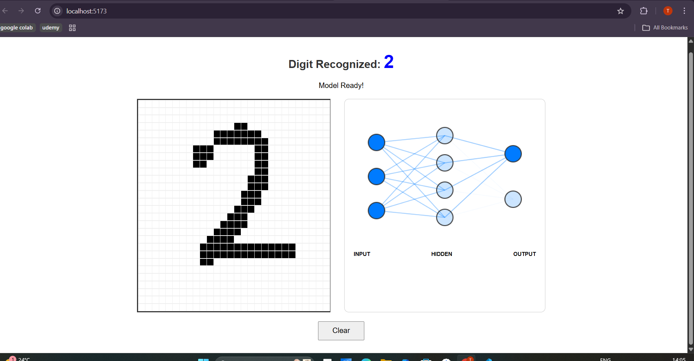
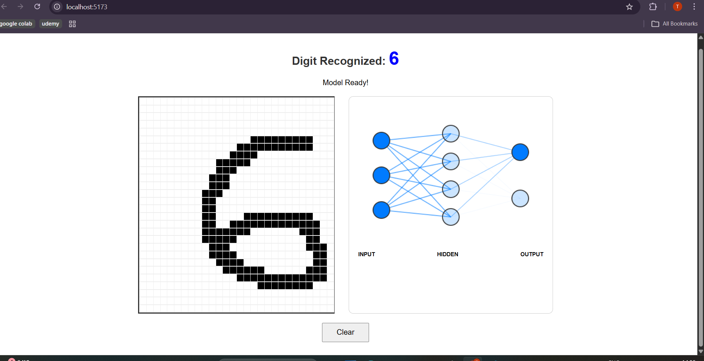

### 🧠 Digit Recognition Visualizer

Interactive Neural Network Playground for Handwritten Digit Classification

An interactive web-based application that demonstrates how a neural network interprets and classifies handwritten digits in real time.

Users can draw digits on a 28×28 grid (MNIST-style), and the trained model predicts the digit instantly. The prediction process is visualized through a neural network diagram, helping users understand how machine learning models process pixel data.

## 📸 Demo Screenshots

<div align="center">
🔢 Digit 2 Recognized

🔢 Digit 6 Recognized
 </div>

## 🚀 Key Features

🖌️ 28×28 interactive drawing grid

⚡ Real-time digit prediction (0–9)

🧠 Neural network inference directly in the browser

📊 Visual neural network representation (Input → Hidden → Output)

🎯 Output layer highlights predicted digit

🧹 Clear/reset drawing functionality

💡 Lightweight and fast client-side model execution

## 🧠 How It Works

1️⃣ Drawing Phase

The user draws a digit on a 28×28 pixel grid.

2️⃣ Preprocessing

Pixel data is captured from the grid

Converted to grayscale values

Normalized between 0 and 1

Flattened into a 784-length input vector

3️⃣ Model Inference

The trained neural network processes the input:

Input Layer: 784 neurons
Hidden Layer: Dense (ReLU)
Hidden Layer: Dense (ReLU)
Output Layer: 10 neurons (Softmax)

4️⃣ Prediction

Softmax probabilities are generated

Highest probability digit is selected

Predicted digit is displayed and visually highlighted

## 📊 Model Details

Dataset: MNIST Handwritten Digits

Framework (Training): TensorFlow (Python)

Framework (Deployment): TensorFlow.js

Loss Function: Categorical Crossentropy

Optimizer: Adam

Accuracy: ~97–99% (depending on training configuration)

🛠️ Tech Stack
💻 Frontend

React (Vite)

JavaScript (ES6+)

HTML/CSS

Custom Grid Canvas System

🤖 Machine Learning

TensorFlow

TensorFlow.js

MNIST Dataset

🔧 Tools

Git & GitHub

Model Conversion (TensorFlow → TensorFlow.js)

## 📂 Project Structure

```text
digit-recognition-visualizer/
│
├── frontend/                 # React frontend
├── training/                 # Model training scripts
├── assets/                   # Screenshots
│   ├── digit-2.png
│   └── digit-6.png
├── README.md
└── .gitignore
```

## 🎯 What This Project Demonstrates

This project showcases:

✅ End-to-end ML pipeline (training → conversion → deployment)

✅ Integration of ML models into a frontend application

✅ Real-time browser-based inference

✅ Neural network visualization concepts

✅ Applied Machine Learning in production-style setup

It reflects both AI/ML engineering skills and frontend development capability.

## 🧪 How to Run Locally

1️⃣ Clone the Repository
git clone https://github.com/your-username/digit-recognition-visualizer.git
cd digit-recognition-visualizer/frontend

2️⃣ Install Dependencies
npm install

3️⃣ Start Development Server
npm run dev

## Open:

http://localhost:5173

🔮 Future Improvements

📊 Show probability distribution chart for digits 0–9

🧠 Add CNN-based architecture for improved accuracy

🎨 Improve UI animations

📱 Mobile drawing support

🌍 Deploy publicly with CI/CD

🔍 Visualize hidden layer activations

## 👤 Author

**Tanish Gupta**  
Computer Science Engineer | AI/ML Enthusiast
